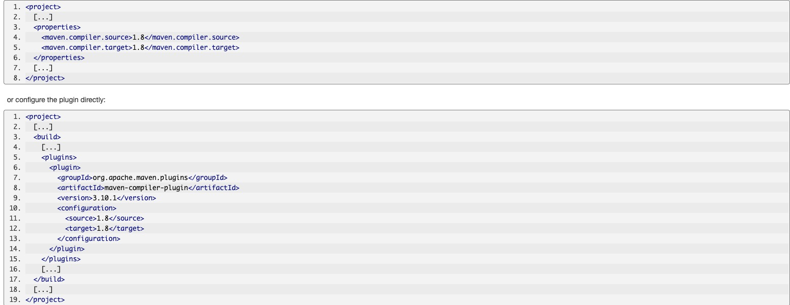

# Maven Course taught by Java Brains


## Compiling maven project
```
mvn compile 
```
- compile all the .java files and keep this classes file in target\classes folder
- It look for java files in src/main


## Testing and Packaging in maven
```
mvn package  
mvn test  
```
- create jar file
- running test classes (can have million test classes)

## Desclearing and using properties
- one thing we can do is declare variable: for eg: 
```
<properties>
    <junit.version>4.11</junit.version>
</properties>
```

- we can use that variable later in the xml file like this: 
```
<dependencies>
    <dependency>
      <groupId>junit</groupId>
      <artifactId>junit</artifactId>
      <version>${junit.version}</version>
      <scope>test</scope>
    </dependency>
  </dependencies>
```

## maven local concepts:
- It look for local respository in your computer. somewhere inside .m2 folder in home dirtectory.
- when you have 3.10.SNAPSHOT. maven look in remote respository is newer version is released.

## Running maven install
- you can publish the mvn artifact and another project can use that artifacts.
```
mvn install
```
- It is going to generate .jar artifacts and puiblish it into local repo.

## plugins in maven:
```
mvn jetty:run
```
- It will start jetty and run our program in jetty container.

## Maven Lifecycle

### Default build lifecycle
```
mvn validate -- validate project
mvn compile -- create class files
mvn test -- run test cases
mvn package -- create jar/war
mvn verify -- integration verification
mvn install -- deploy in local repository
mvn deploy -- deploy to remote repository
```

### clean lifecycle
```
mvn clean 
```
- remove build generate file

### site lifecycle
```
mvn site -- generate report in the form of html.
mvn site-deploy
```


## maven plugins
- maven is plugin heavy architecture. mvn compile is not maven specific. (compile is a plugin)
```
mvn <pluginName>:<phasename>

mvn compiler:compile
mvn compile

Basically the shortcut.
```

## creating new projecvt
```
mvn archetype:generate
```
- archetype: plugin name
- generate: phase name


## Default plugin 
- default plugin can be removed 
- plugin can be configured.

For eg:



## Multi module maven project
